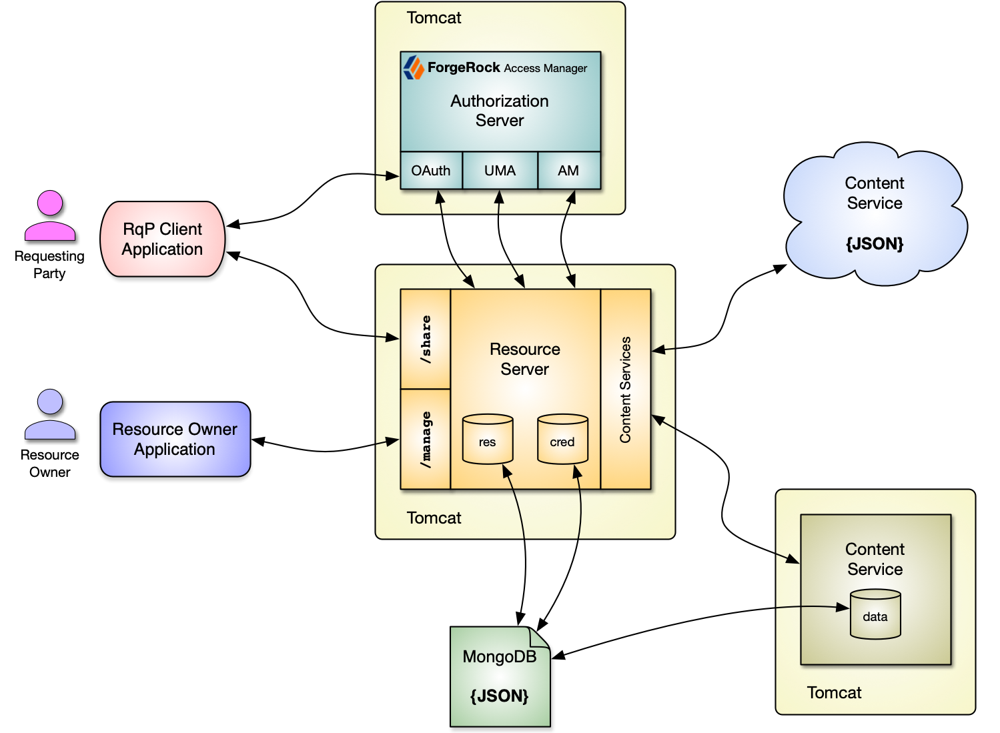

# frdp-uma-resource-server

ForgeRock Demonstration Platform : **UMA Resource Server** : A deployable web service that provides REST / JSON operations for the [User Managed Access (UMA) 2.0](https://kantarainitiative.org/confluence/display/uma/Home)  Resource Server (RS) functionality.  This service is implemented using the Java JAX-RS/Jersey REST API and MongoDB for document persistance. This service also leverages the [ForgeRock Access Manager](https://www.forgerock.com/platform/access-management) for the UMA 2.0 Authorization Server (AS) functionality.



`git clone https://github.com/ForgeRock/frdp-uma-resource-server.git`

# Disclaimer

THE SOFTWARE IS PROVIDED "AS IS", WITHOUT WARRANTY OF ANY KIND, EXPRESS OR IMPLIED, INCLUDING BUT NOT LIMITED TO THE WARRANTIES OF MERCHANTABILITY, FITNESS FOR A PARTICULAR PURPOSE AND NONINFRINGEMENT. IN NO EVENT SHALL THE AUTHORS OR COPYRIGHT HOLDERS BE LIABLE FOR ANY CLAIM, DAMAGES OR OTHER LIABILITY, WHETHER IN AN ACTION OF CONTRACT, TORT OR OTHERWISE, ARISING FROM, OUT OF OR IN CONNECTION WITH THE SOFTWARE OR THE USE OR OTHER DEALINGS IN THE SOFTWARE.

# License

[MIT](/LICENSE)

# Reference 

- Specification: [User-Managed Access (UMA) 2.0 Grant for OAuth 2.0 Authorization](https://docs.kantarainitiative.org/uma/wg/rec-oauth-uma-grant-2.0.html)
- Specification: [Federated Authorization for User-Managed Access (UMA) 2.0](https://docs.kantarainitiative.org/uma/wg/rec-oauth-uma-federated-authz-2.0.html)
- Documentation: [ForgeRock Access Manager 7, User Managed Access (UMA) 2.0 Guide](https://backstage.forgerock.com/docs/am/7/uma-guide/)

# Requirements

The following items must be installed:

1. [Apache Maven](https://maven.apache.org/) *(tested with 3.5.x, 3.6.x)*
1. [Java Development Kit 11](https://openjdk.java.net/projects/jdk/11/)
1. [MongoDB](https://www.mongodb.com) *(tested with 3.2)*
1. [Apache Tomcat](https://tomcat.apache.org/index.html) *(tested with Tomcat 9.0.x)*
1. [ForgeRock Access Manager](https://www.forgerock.com/platform/access-management) *(tested with 7.0)*

# Build

## Prerequisite:

The following items must be completed, in the following order:

1. [frdp-framework](https://github.com/ForgeRock/frdp-framework) ... clone / download then install using *Maven* (`mvn`)
1. [frdp-dao-mongo](https://github.com/ForgeRock/frdp-dao-mongo) ... clone / download then install using *Maven* (`mvn`)
1. [frdp-content-server](https://github.com/ForgeRock/frdp-content-server) ... clone / download then install using *Maven* (`mvn`)
1. [frdp-dao-rest](https://github.com/ForgeRock/frdp-dao-rest) ... clone / download then install using *Maven* (`mvn`)

## Clean, Compile, Install:

Run *Maven* (`mvn`) processes to clean, compile and package the war file:

```
mvn clean compile package
```

The *package* process creates a deployable war file, in the current directory: `./target/resource-server.war`: 

```
ls -la ./target
total 12488
drwxrwxr-x 5 forgerock forgerock       89 Oct 21 20:57 .
drwxrwxr-x 7 forgerock forgerock      155 Oct 21 20:57 ..
drwxrwxr-x 3 forgerock forgerock       16 Oct 21 20:57 classes
drwxrwxr-x 2 forgerock forgerock       27 Oct 21 20:57 maven-archiver
drwxrwxr-x 4 forgerock forgerock       95 Oct 21 20:57 resource-server
-rw-rw-r-- 1 forgerock forgerock 12787600 Oct 21 20:57 resource-server.war
```

# Settings

The procedures in this document will use the following settings.  You will need to change some of these settings to match your test environment.

| Technology   | Category | Name      | Value      |
| ------------ | -------- | --------- | ---------- |
| **MongoDB**   |
|              | Default 
|              |          | Password:  | `password` |
|              |          | Port:      | `27017`    |
| **Tomcat** |
|              | Access Manager |
|              |               | HTTP Port:  | `18080` |
|              |               | HTTPS Port: | `18443`
|              | Applications  |
|              |               | HTTP Port: | `38080` |
|              |               | HTTPS Port: | `38443` |
| **Access Manager** |
|                | Admin User 
|                |            | User Id: | `amadmin` |
|                |            | Password: | `password` |
|                | OAuth Client: Resource Server |
|                |                 | Client Id: | `UMA-Resource-Server` |
|                |                 | Client Secret: | `password` |
|                | OAuth Client: Requesting Party |
|                |                 | Client Id: | `UMA-RqP-Client` |
|                |                 | Client Secret: | `password` |
|                | User: Resource Owner |
|                |                 | User Id: | `dcrane` |
|                |                 | Password: | `password` |
|                | User: Requesting Party |
|                |                 | User Id: | `bjensen` |
|                |                 | Password: | `password` |

# Configure MongoDB

The MongoDB object database needs to be configured for the **resources** and **credentials** collections in the **resource-server** database.

1. Access MongoDB system \
\
`ssh root@hostname`
1. Connect as the "root" MongoDB user to create the database and collections \
\
`mongo --username "root" --password "<ROOT_PASSWORD>" --authenticationDatabase "admin" admin`
1. We need to do some database initialization ... 
Specify the database name: `resource-server`.
Drop database if it already exists. 
Create an admin user, remove first, for the database: `resourceadmin`. 
Create two collections: `credentials` and `resources`. Quit MongoDB. \
\
`use resource-server;` \
`db.dropDatabase();` \
`db.dropUser("resourceadmin");` \
`db.createUser({user:"resourceadmin",pwd:"password",roles:["readWrite","dbAdmin"]});` \
`db.createCollection("credentials");` \
`db.createCollection("resources");` \
`quit();`

1. Connect as the "resourceadmin" user for the `resource-server` database.\
\
`mongo --username "resourceadmin" --password "password" --authenticationDatabase "resource-server" resource-server`
1. Create indexes for both the `resources` and `credentials` collections. 
Insert test documents into both collections. 
Read the documents from both collections. Quit MongoDB. \
\
`db.resources.createIndex({"uid":1});` \
`db.resources.createIndex({"data.owner":1});` \
`db.resources.createIndex({"data.register":1});` \
`db.credentials.createIndex({"uid":1});` \
`db.credentials.createIndex({"data.owner":1}, {unique: true});` \
`db.resources.insert({"comment": "This is a test document"});` \
`db.credentials.insert({"comment": "This is a test document"});` \
`db.resources.find();` \
`db.resources.find().pretty();` \
`db.credentials.find();` \
`db.credentials.find().pretty();` \
`quit();`

# Configure Access Manager

The ForgeRock Access Manager (7.0) needs to be configured to support the UMA 2.0 Authorization Server (AS) functionality. The ForgeRock Access Manager Policy APIs and OAuth 2.0 functionality will also configured. See the Access Manager 7.0 [User Managed Access (UMA) 2.0 Guide](https://backstage.forgerock.com/docs/am/7/uma-guide/) for installation details.

These procedures will create and configure:
- **OAuth2 Provider** 
- **UMA Provider**
- **OAuth 2.0 Client Agent**, application used by the Requesting Party (RqP)
- **OAuth 2.0 Resource Server (RS)**
- **Resource Owner (RO)**, the user, `dcrane`, that owns the resources
- **Requesting Party (RqP)**, the user, `bjensen`, that requests and gets access to the resources

See the Access Manager 7.0 [UMA Setup Procedures](https://backstage.forgerock.com/docs/am/7/uma-guide/uma-set-up-procedures.html) documentation for details

Log into the Access Manager admin console as ``amadmin``

## Create / Update OAuth2 Provider

**NOTICE:** *If you are using an existing Access Manager installation and these Providers exist, they will be replaced.*

Create / update the Access Manager **OAuth2 Provider** ... the following configuration is required:

| Attribute | Value |
| --------- | ----- |
| `Issue Refresh Tokens` | **enabled** |
| `Issue Refresh Tokens on Refreshing Access Tokens` | **enabled** |
| `supportedGrantTypes` | at least contains '**UMA**' and '**Resource Owner Password Credentials**' |

## Create UMA Provider

**NOTICE:** *If you are using an existing Access Manager installation and these Providers exist, they will be replaced.*

Create / update the Access Manager Provider: **UMA Provider** ... the following configuration is required:

- Use default settings

## Create OAuth 2.0 *UMA Requesting Party (RqP)* Client

Create an OAuth 2.0 client for the Requesting Party (RqP) application, which will access resources. The following configuration is required:

| Attribute | Value |
| --------- | ----- |
| `Client ID` | **UMA-RqP-Client** |
| `Client Secret` | **password** |
| `Redirection URIs` | *(leave blank)* |
| `Scopes` | '**read**' and '**openid**' |
| `Display Name` | **UMA RqP** |
| `Display Description` | **User Managed Access (UMA) Requesting Party Client** |
| `Grant Types` | include: '**Authorization Code**', '**UMA**', and '**Resource Owner Password Credentials**' |

## Create OAuth 2.0 *UMA Resource Server (RS)* Client

Create an OAuth 2.0 client for the Resource Server (RS) application.  The following configuration is required:

| Attribute | Value |
| --------- | ----- |
| `Client ID` | **UMA-Resource-Server** |
| `Client Secret` | **password** |
| `Redirection URIs` | *(leave blank)* |
| `Scopes` | **uma_protection** |
| `Display Name` | **UMA RS** |
| `Display Description` | **User Managed Access (UMA) Resource Server** |
| `Grant Types` | include: '**Authorization Code**', '**Refresh Token**', and '**Resource Owner Password Credentials**' |

## Create *Resource Owner (RO)* User

Create a user to represent the **Resource Owner**.  Use the following attributes:

| Attribute | Value |
| --------- | ----- |
| `User Id` | **dcrane** |
| `Password` | **password** |
| `First Name` | **Danny** |
| `Last Name` | **Crane** |
| `Full Name` | **Danny Crane - Resource Owner** |
| `Email` | **dcrane@example.com** |
| `Status` | **Active** |

## Create *Requesting Party (RqP)* User

Create a user to represent the **Requesting Party**.  Use the following attributes:

| Attribute | Value |
| --------- | ----- |
| `User Id` | **bjensen** |
| `Password` | **password** |
| `First Name` | **Barb** |
| `Last Name` | **Jensen** |
| `Full Name` | **Barb Jensen - Requesting Party** |
| `Email` | **bjensen@example.com** |
| `Status` | **Active** |

# Install Resource Server

This example deploys the `resource-server.war` file to an Apache Tomcat 8.x environment.

## Deploy war file

Copy the `resource-server.war` file to the `webapps` folder in the Tomcat server installation.  The running Tomcat server will automatically unpack the war file.

```bash
cp ./target/resource-server.war TOMCAT_INSTALLATION/webapps
```

## Configure `resource-server.json`

The deployed Resource Server application needs to be configured.  Edit the `resource-server.json` file and change / check the values.

```bash
cd TOMCAT_INSTALLATION/webapps/resource-server/WEB-INF/config
vi resource-server.json
```
Edit the following sections of the JSON file:

### Resource Server (RS): No SQL Database (MongoDB): 
JSON Object ... `rs.nosql`:

```json
{
   "nosql": {
      "comment": "No SQL Database (MongoDB)",
      "host": "mongo.example.com",
      "port": "27017",
      "authen": {
         "database": "resource-server",
         "user": "resourceadmin",
         "password": "password"
      }
   }
}
```

- Set `host`: Fully Qualified Domain Name (FQDN) of installation
- Set `port`: Port for MongoDB service, default is *27017*
- Set `password`: Password for MongoDB resource-server, *resourceadmin* user

### Resource Server (RS): OAuth 2.0 Client: 
JSON Object ... `rs.oauth2.client`

```json
{
   "client": {
      "id": "UMA-Resource-Server",
      "secret": "password",
      "redirect": "https://uma.example.com:443/resource-server"
   }
}
```

- Set **secret**: Password for the OAuth 2.0 Client: `password`
- Set **redirect**: This value **MUST** match the redirect when configuring the OAuth 2.0 client

#### NOTICE:  The `client` attributes MUST match the values used when the Access Manager OAuth 2.0 Client `UMA-Resource-Server` configuration:

- `id`
- `secret`
- `redirect`

### Authorization Server (AS) Connection: 
JSON Object ... `as.connect`

```json
{
   "connect": {
      "protocol": "https",
      "host": "as.example.com",
      "port": "443",
      "path": "am"
   }
}
```

- Set **protocol**: `http` or `https`
- Set **host**: Fully Qualified Domain Name (FQDN) of installation
- Set **port**: Port that has the Access Manager installed: `443`
- Set **path**: Path name for Access Manager: `am`

### Authorization Server (AS) admin credentials: 
JSON Object ... `as.admin`

```json
{
   "admin": {
      "user": "amadmin",
      "password": "password"
   }
}
```

- Set **password**: Password for the Access Manager administrator account: `password`

### Authorization Server (AS) authentication query parameters:

If the Access Manager installation requires the setting of `authIndexType` and `authIndexValue` query parameters ... add the following section to the JSON Object ... `as.authenticate`

```json
{
   ...
   "as": {
      ...
      "authenticate": {
         ...
         "params": {
            "authIndexType": "service",
            "authIndexValue": "ldapService"
         },
         ...
      }
   }
}
```

## Configure `content-services.json`

The deployed Resource Server application needs to be configured.  The Resource Server uses a separate file for the configuration of *content services*.  These instruction will cover the configuration of the `default` Content Service.  Edit the `content-services.json` file and change / check the values.

There's an *array* of `services` we will change the service that has an `id` value of *default*

JSON Object ... `operations.create`

```json
{
   "create": {
      "comment": "Use 'uri' attribute and input 'data' to CREATE external content",
      "action": "post",
      "uri": "https://cs.example.com:443/content-server/rest/content-server/content"
   }
}
```

- Set **uri**: This is the full FQDN path for where content is created, via HTTP POST

### Note: 
- See the [Configurable Content Service project](https://github.com/ForgeRock/frdp-uma-resource-server/wiki/Project:-Configurable-Content-Service) for details on configuring the **Content Service**

## Restart the Tomcat server running the **Resource Server** (`resource-server`)

# Testing

The following Use Cases will test the UMA 2.0 capabilities and "value add" features of the Resource Server:

| Actor            | Use Case       | Category | Description |
| ---------------- | -------------- | -------- | ----------- |
| Resource Owner   | 
|                  | Resources | UMA 2.0 | Create, Read, Update, Delete resources (meta, content, registration, policies).
|                  | People | Value Add | Who has access to my resources.
|                  | Requests | Value Add | Accessing a resource, without permission, will generate a access request.
| Requesting Party | 
|                  | Resources | UMA 2.0 | Accessing shared resources
|                  | Shared With Me | Value Add | What resource do I currently have access to
|                  | Discovery | Value Add | What resources are discoverable
|                  | Revoke Access | Value Add | RqP initiated access revocation

Use the provided Postman [collections](/testing) to test the Use Cases:

- [UMA Resource Owner](/testing/RO/README.md)
- [UMA Requesting Party](/testing/RqP/README.md)

## Ready-2-Run environment

If you want to get started *quickly* with UMA ... take a look this [Containers for UMA](https://github.com/ForgeRock/frdp-containers-uma) GitHub project.  It uses Docker and Docker-Compose to assemble *this* project in about 5 minutes.  There's a [YouTube video](https://www.youtube.com/watch?v=9kPqt5gfI4g) of the project which covers the setup procedure, building of containers, and running of the use cases.